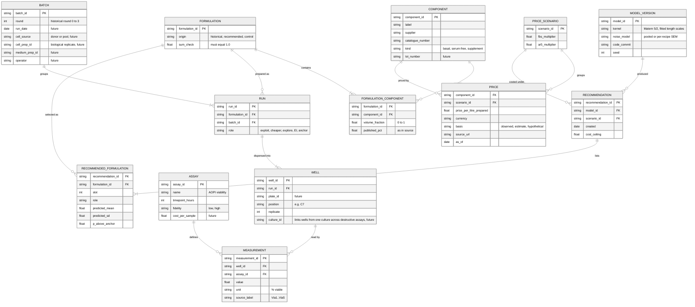

# Data schema

This schema covers two things. The first is what this repo stores today. The second is the Benchling-style model a media-optimisation team would need to run this loop on its own lab data. The repo tables map onto it, and the mapping is shown at the end. Fields marked *future* do not exist in the public workbook and are not invented here.

## Design rules

- Biological replication lives on BATCH (`cell_prep_id`, `medium_prep_id`), not on WELL. Four wells from one cell preparation measure repeatability, not robustness. Confirmation needs independent preparations.

- Keep three kinds of record apart: the recipe (what we intend to mix), the run (what was actually made and when) and the measurement (what the assay read). The same recipe run on two plates is two runs. A model that confuses the two will count re-runs as new information and miss batch effects. The E19 anchor exists for exactly that reason.
- One measurement row per well and readout. Summaries are derived, never stored as if they were raw data.
- Every price carries a currency, a date, a source and a basis (`observed`, `estimate` or `hypothetical`).
- Every recommendation records the model version, the price scenario and the selection rule that produced it.

## Entity model

## Where this repo's files sit

| Entity | Repo file | Notes |
| --- | --- | --- |
| COMPONENT | `data/inputs/price_sources.csv` (catalogue numbers) | 4 media plus FBS and Penicillin-Streptomycin as supplements |
| FORMULATION, FORMULATION_COMPONENT | `data/processed/pbmc_formulations.csv` | Wide format: one fraction column per component |
| BATCH | `round` column | The only batch information in the source |
| RUN, WELL | absent for history; `outputs/plate_layout.csv` for the next batch | The source gives 2 to 5 readings per recipe with no well or donor identity |
| MEASUREMENT | `data/processed/pbmc_measurements.csv` | One row per reported reading |
| ASSAY | `assay`, `timepoint_hours` columns | One assay, so no fidelity levels |
| PRICE, PRICE_SCENARIO | `data/inputs/component_costs.csv`, `data/inputs/cost_scenarios.csv` | Base prices plus 9 scenarios |
| RECOMMENDATION, RECOMMENDED_FORMULATION | `outputs/next_experiments.csv` | One row per slot, with predictions and stability |
| MODEL_VERSION | `scripts/compare_models.py`, seed 20261002 | Not yet stored as a record |

## What changes for a multi-fidelity setup

Cosenza et al. (2022) paired cheap 3-day assays (AlamarBlue, LIVE stain) with 6-day cell counts. In this schema, that is two ASSAY rows with different `fidelity` and `cost_per_sample` values. Non-destructive readouts attach to the same WELL. A destructive assay needs its own WELL, linked to its sister wells through `culture_id`, so the model can pair measurements from one culture. The model then learns how the cheap readout maps to the expensive one. No new tables are needed. That is the test of a schema: the next experiment design should fit without a migration.
