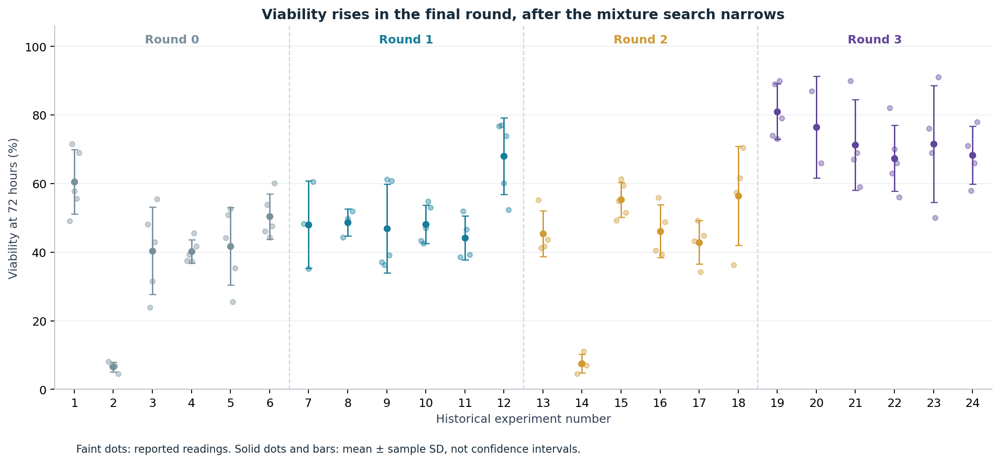
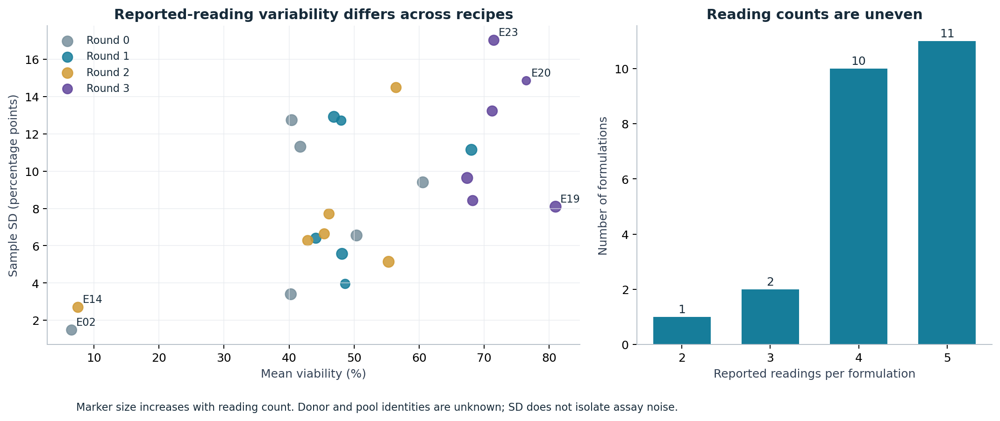
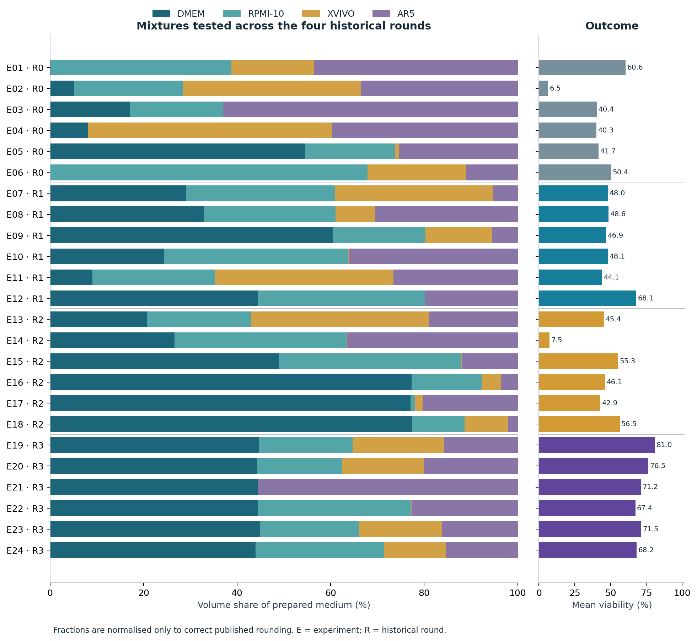
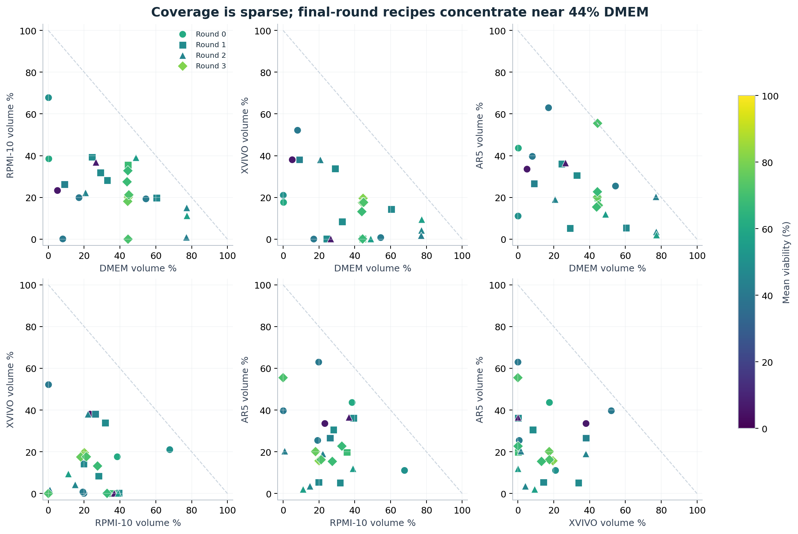
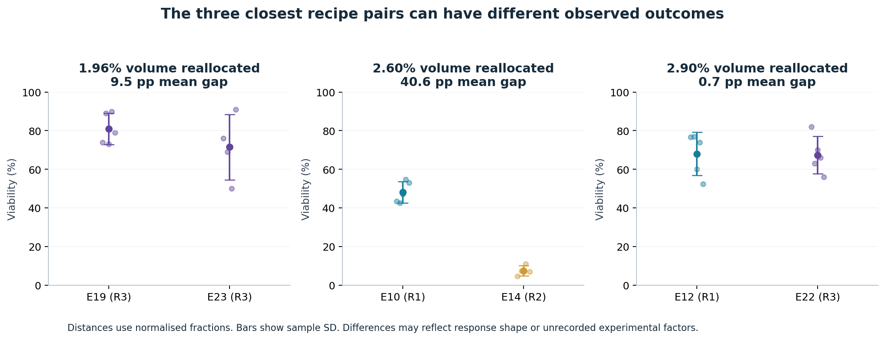

# Exploratory analysis of PBMC media blends

The public dataset supports a small, noise-aware mixture optimisation demonstration. The final historical round contains the highest viability readings, but recipe choice and round are intertwined. Nearby recipes sometimes have markedly different outcomes. Use conservative modelling and a diverse next batch; do not infer individual ingredient effects from these plots.

## Dataset and outcome

There are 24 unique mixtures and 103 reported readings across four rounds of six formulations. Means range from 6.54% to 81.00% viability after 72 hours. Two formulations have means below 10%; all remain in the dataset. There are 4 formulations at or above 70%, all from round 3. The 70% threshold is a descriptive reference, not an agreed optimisation constraint.

Round means are 39.98%, 50.65%, 42.29% and 72.65%. These describe adaptively selected recipes, not randomised evidence of a round effect. A random train/test split can give optimistic results because it mixes the tightly clustered final round into both sets.

## Variation between readings

The median within-formulation sample SD is 8.26 percentage points, with a range of 1.48 to 17.02. A pooled within-formulation SD is 9.51 percentage points. This describes reported-reading spread and does not isolate technical assay error. Counts range from two to five readings, and 17 reading slots are missing. E20 has only two readings despite having the second-highest mean.

E19 has the highest mean (81.0%), followed by E20 (76.5%) and E23 (71.5%). Their sample SDs are 8.09, 14.85 and 17.02 percentage points. These point estimates do not establish a reliable ranking. Donor/pool identities and independence are unknown, so this analysis does not calculate significance tests or biological confidence intervals.

## Mixture coverage

The four fractions sum to one, leaving three independent degrees of freedom. Final-round DMEM proportions lie between 43.96% and 44.94%. All final-round outcomes exceed 67%, but earlier mixtures with similar DMEM fractions differ in the other components. The pattern suggests a candidate region to investigate, not a stand-alone optimum for DMEM.

Only 24 points cover the mixture space. None is a pure-medium vertex in the training set. Pairwise plots are projections; they can hide differences in the other fractions. Low-outcome formulations E02 and E14 are not removed as outliers: their readings consistently support their low means, and their cause is unknown.

## Nearby recipes and response consistency

E10 and E14 differ by reallocation of only 2.60% of total medium volume, yet their observed mean viability differs by 40.63 percentage points (48.15% versus 7.52%). The discrepancy is large compared with each recipe's reported-reading spread. They belong to different historical rounds; nonlinear biology, preparation effects or unrecorded experimental conditions are possible explanations. The data cannot identify which explanation is correct.

The closest pair is PBMC-E19/PBMC-E23, with 1.96% volume reallocated and a 9.5 percentage-point mean difference. Do not collapse near-neighbour recipes into exact replicates or let a flexible model explain all discrepancies through very short length scales.

## Descriptive component associations

| Component | All experiments | After centring within each round | Excluding means below 10% |
| --- | --- | --- | --- |
| DMEM | 0.30 | 0.28 | 0.16 |
| RPMI-10 | -0.05 | 0.08 | 0.04 |
| XVIVO | -0.19 | -0.15 | -0.19 |
| AR5 | -0.21 | -0.27 | -0.09 |

Entries are Pearson correlations, not independent ingredient effects. Mixture fractions are dependent, experiments were adaptively selected and there are only six recipes per round. Round centring is a descriptive sensitivity calculation, not a fitted causal adjustment. The below-10% exclusion is a sensitivity calculation only; the full dataset remains the modelling input.

## Implications for the next modelling step

- Use a conservative GP on the constrained mixture domain, with a simple regression sanity check and feasible random sampling baseline. Fit transformations within validation folds.
- Compare pooled observation noise with recipe-specific noise proxies; repeat under larger noise assumptions. The stored variance-of-mean proxy assumes independent readings and may understate biological uncertainty.
- Use leave-formulation-out diagnostics and forward-round evaluation. Report fold-specific errors and uncertainty coverage; the latter will be descriptive with this sample size. Group exact repeated formulations if future data introduce them.
- Inspect predictive behaviour around E10/E14. Compare all-data results against a sensitivity fit withholding each low-outcome recipe in turn; never silently exclude them.
- Evaluate candidate proximity to historical recipes and avoid an entire batch of nearly identical high-ranked blends. Include an informative candidate outside the final-round cluster.
- Apply nonnegative fractions and the sum-to-one constraint during generation, then recheck recipes after dispensing-volume rounding.
- This descriptive analysis ignores cost. Provisional catalogue-based prices and nine price scenarios are applied later, in `scripts/design_space.py` and `scripts/select_batch.py`.

## Reproduction

Run `python scripts/explore_data.py` after data preparation. Outputs are five PNG/PDF figures and descriptive CSV/JSON tables. The script checks that reading counts, means and SDs reconcile with the prepared dataset. It does not fit a model or recommend new experiments.
