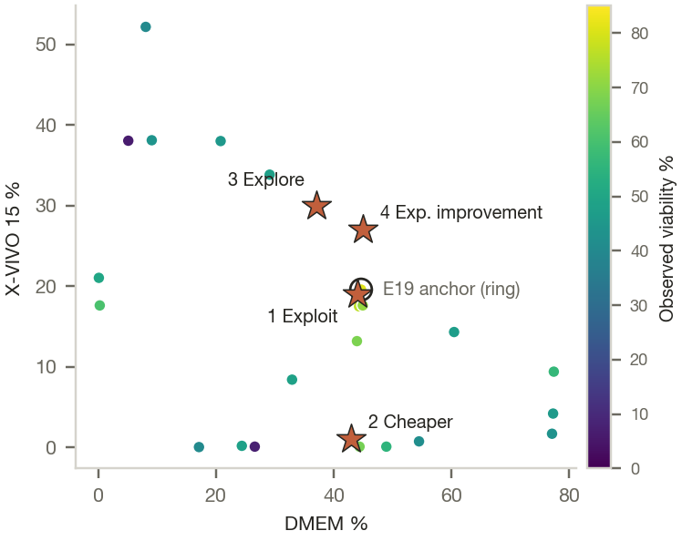
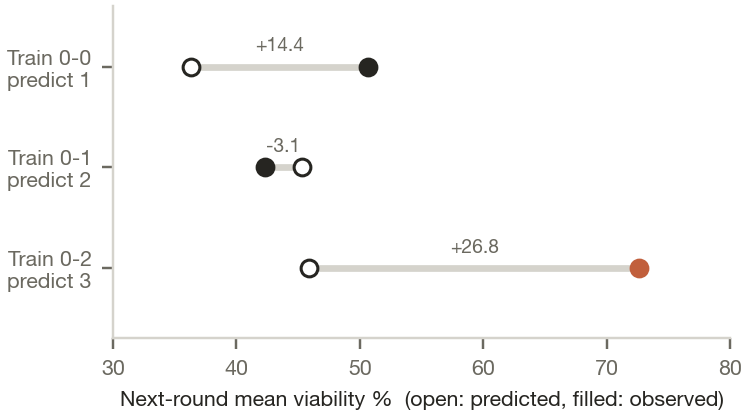
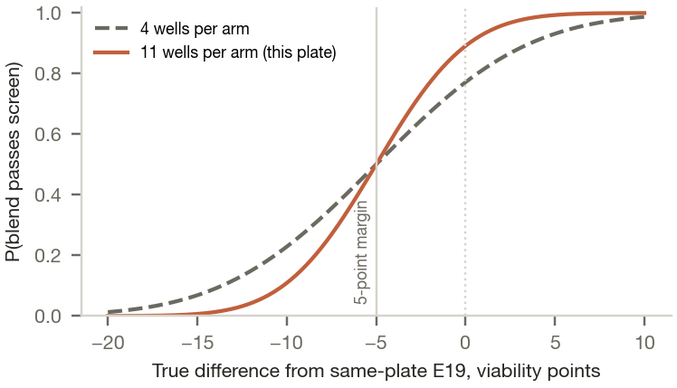
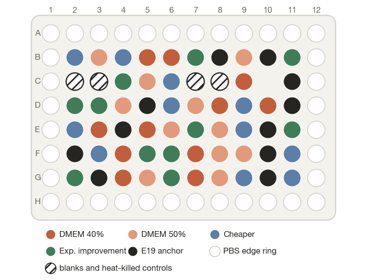

The data cannot tell us which blend is best. They point to one signal, DMEM near 44%, and a model that is confident about it without having earned that confidence. The next plate tests that signal directly, at no more than E19's cost, with enough replicates to read the result.

## Recommendation

Five formulations, 11 randomised wells each: two designed DMEM steps around the best blend, two model picks, and a same-plate re-run of the best historical blend (E19).

| Slot | Role | DMEM | RPMI-10 | X-VIVO 15 | AR5 | EUR/L | Model estimate (80% range) | P(above E19) |
|---|---|---|---|---|---|---|---|---|
| 1 | DMEM step down | 40% | 22% | 21% | 17% | 178.19 | 66.3 (48.4 to 84.1) | 0.26 |
| 2 | DMEM step up | 50% | 18% | 18% | 14% | 178.69 | 62.5 (44.6 to 80.4) | 0.12 |
| 3 | Cheaper alternative | 43% | 56% | 1% | 0% | 173.92 | 65.9 (49.2 to 82.6) | 0.27 |
| 4 | Expected improvement | 44% | 21% | 28% | 7% | 178.32 | 69.1 (51.3 to 86.8) | 0.39 |
| Anchor | E19 re-run | 44.6% | 20.1% | 19.6% | 15.7% | 178.43 | 70.1; observed 81.0 | |

*The model shrinks E19's observed 81.0 to 70.1, because the top of six noisy results is partly luck; compare picks with 70.1, not 81. Ranges are for one measured recipe mean under the model. P(above E19) uses the joint posterior and ignores shifts between batches.*

<figure class="float"><figcaption>Picks (stars) against the 24 historical blends. Slots 1 and 2 sit on a line through E19: same ratios of the other three media, DMEM moved down and up.</figcaption></figure>

**Why these four.** DMEM is the only component with a clear signal. Across rounds 1 and 2, blends at 29 to 33% DMEM scored 48 to 49%, E12 at 44.5% scored 68.1%, and blends at 60 to 77% scored 43 to 56%. All six round-3 blends sit at 44 to 45% DMEM and score 67 to 81% while their other three components vary widely. The model's DMEM length scale sits at its floor: it believes viability changes sharply with DMEM, yet 40% and 50% at E19's ratios have never been tested. Slots 1 and 2 test that belief on one line through E19. Slot 3 asks whether RPMI-10 can replace both serum-free media; slot 4 whether X-VIVO 15 can replace AR5, the medium with no public price.

**Cost.** Model picks cost no more per litre than E19 in at least 6 of 9 FBS and AR5 price scenarios. The designed steps may cost up to 1% more: 50% DMEM is EUR 0.26/L over E19, a gap smaller than the uncertainty in the FBS price itself. Savings against E19 are small (up to 2.53%), so this ceiling screens candidates; it is not a business case.

**What I changed after review.** An earlier version used four model picks. One of them, 44/26/19/11, was 0.981 correlated with E19 under the model and predicted at 70.2 against E19's 70.1: a well the model priced at nothing and the assay could not resolve. Independent reviewers flagged it, and I replaced it and the exploration pick with the two DMEM steps.

## Problem, objective and constraints

The decision is which 3 to 5 formulations go on the next plate, when each round takes days, single results are noisy and only 24 historical blends exist. The goal is a next experiment that teaches the lab something whatever the result, not the best prediction.

**Objective.** Maximise mean PBMC viability at 72 hours, subject to a cost per litre of prepared medium no higher than E19's under the same price scenario. I chose a constraint over a weighted score because a lab manager can check a constraint by hand.

| Constraint or assumption | Value | Source or reason |
|---|---|---|
| Mixture | Fractions sum to 100%, whole percentages | 176,851 candidates |
| Cost | Model picks at or below E19 (EUR 178.43/L) in 6 of 9 scenarios; designed steps up to 1% over | Cost rule |
| Spacing | At least 5% of volume from any tested recipe, single medium or other pick | No near-duplicates |
| Capacity | 5 formulations, 11 wells each | Brief caps at 5; 36 wells were idle |
| Endpoint | Viability at 72 h, plus viable cells per mL | Only public endpoint |
| Cells | PBMCs stand in for bovine fibroblasts | Allowed by the brief |
| Prices | FBS from a search snippet; AR5 unpriced, set equal to X-VIVO 15 and varied to 2.02 times | `price_sources.csv` |
| Lab | Blends at 1% resolution; cells for 57 wells from one donor | To confirm |

## What the data says

I used the public PBMC media-blending data from Narayanan et al. (2025): 24 blends of four commercial media in four rounds of six, 103 viability readings at 72 hours. The tables are complete and labelled, and a four-part mixture keeps cost and feasibility checkable. PBMCs are human immune cells, not bovine fibroblasts, and two of the four media carry 10% FBS: the method transfers to Qorium, the recipes do not.

| Finding | Number | So what |
|---|---|---|
| Round 3 beat every earlier round | 72.65% vs 39.98 to 50.65% | Recipe and lab day are confounded within the main data |
| E19's recipe was re-run in a separate comparison in the same paper | 80.2% (n = 6, SD 7.5) | Round 3 partly reproduces; the anchor measures what is left |
| Two near-identical blends disagree | E10 48.15% vs E14 7.52%, 2.60% of volume apart | E14 is most likely a technical failure; I keep it in the fit because dropping data by outcome biases the model |
| Readings are noisy | pooled within-recipe SD 9.51 points | A 5-point gap is inside the noise of four readings |

<figure class="float"><figcaption>Forward test of the GP: trained on earlier rounds, it missed round 3 by 26.8 points.</figcaption></figure>

**Models.** I compared a GP, a random forest, a Scheffe quadratic mixture model and the plain mean. On all 24 blends no model beats the mean on honest uncertainty (NLPD 4.44 for the mean against 5.93 for the GP). The GP's leave-one-out rank correlation of 0.61 comes from separating round 3 from the rest; within rounds 0 to 2 it is 0.11. The Scheffe model fails because its 10 coefficients face 24 points, six of them on one DMEM line and two near 7%. The forward test is the honest one: every model under-predicted round 3 by 22 to 29 points. So the GP proposes candidates and the plate decides.

**Why a GP.** It returns an estimate and its uncertainty together, which batch selection needs to weigh "likely good" against "unknown". It handles small, noisy data through an explicit noise term, and pending picks can be conditioned on exactly, which makes batch selection simple. The random forest matched its error but gives no principled uncertainty; the Scheffe model ranked no better than chance. BoTorch or Ax would add little on 24 points and four components; scikit-learn with explicit conditioning is easier to check (`check_gp.py`).

**Mixture coordinates.** Four fractions summing to one carry one redundant coordinate. Dropping X-VIVO 15 as a coordinate moves the model picks by 1 to 8% of volume; dropping DMEM moves them by up to 72%, because DMEM is where the signal is and hiding it inside the other three changes the kernel's smoothness assumptions. I keep all four with a floor on the length scales; log-ratio coordinates are the standard alternative for the next round.

## How sure we are

| Source of uncertainty | How I handle it |
|---|---|
| Reading noise | The GP learns 11.83 points SD on a recipe mean, against a root-mean-square reading SEM of 4.97; the gap covers run-to-run variation and model error, so I use the larger figure |
| Model form | Reruns with other noise models, length-scale limits and three-coordinate fits |
| Unexplained low results | Reruns without E02 and without E14 |
| Prices | Reruns under 8 other FBS and AR5 price scenarios |
| My selection rules | One-at-a-time changes to the cheaper margin, minimum gap, scenario rule and cost tolerance |
| Batch shift | E19 re-run on the same plate; 11 wells per formulation in randomised row blocks |

<figure class="float"><figcaption>Chance a blend passes the 5-point screen. Eleven wells per arm sharpen the screen at no cost in formulations.</figcaption></figure>

**Robustness.** I reran the selection 19 times: other noise models, length-scale limits, three-coordinate fits, without E02 or E14, with E19 not pending, with a 1% cost tolerance for model picks, and under 8 other price scenarios. The DMEM steps are fixed by design. Slot 3 moved by a median 16% of volume, mainly with prices; slot 4 by a median 6%, and by 72% only in the fit without DMEM as a coordinate.

**Simulation.** I ran 30 paired campaigns of 18 blends against two smooth synthetic truths at two noise levels, with the same rules and measurement errors for every policy. Random picks inside the rules ended 1.6 to 2.1 points from the best blend. Only UCB beat random reliably, and only at low noise (sign test p = 0.016 and 0.001, out of 16 exploratory comparisons). At the fitted noise of 11.8 points I detected no advantage for any policy, and the blend picked from single noisy readings sat 4.7 to 7.9 points below the best. That is why this plate spends wells on replicates and two slots on designed contrasts rather than four model picks. The simulation did not test that remedy.

**Exploration and exploitation.** The batch explores where the model is most confident and least tested, the sharp DMEM peak, with two designed steps that answer a clear question whatever the model believes. It exploits with two model picks at the current DMEM level: one for cost, one for the most promising change. The anchor makes all four readable against the best blend on the same plate.

## From plate to decision

<figure class="float"><figcaption>11 wells per formulation in randomised row blocks, PBS edge ring, blanks and heat-killed controls.</figcaption></figure>

**1. Is the plate valid?** All 57 cell-containing wells use one donor, one thaw and logged FBS and medium lots. The assay owner checks missing wells, spread, blanks and the dead-cell gate against criteria set before the run. An invalid plate is repeated, not interpreted. The source study pooled cultures before reading, so reading single wells is a protocol change to agree first.

**2. Screen.** A blend passes if its mean is no more than 5 points below the same-plate E19, at equal or lower cost. With 11 wells per arm the 90% interval on that difference is about plus or minus 7 points: a blend equal to E19 passes 89% of the time, one 10 points worse 11%. A pass means "not excluded". A lead needs a mean above E19 by more than the interval.

**3. Confirm, then decide.** One finalist, two at most, compared with concurrent E19 across independent cell and medium preparations on different days. This plate estimates variation within one preparation only; independent repeats come first and size the confirmation. Accept if the one-sided 95% lower bound on the difference stays above minus 5 points, with acceptable cost and quality, and with the business case agreed separately as cost per unit of acceptable output.

| Valid plate shows | Next step |
|---|---|
| Viability falls off at 40% or 50% DMEM | The sharp DMEM peak is real; search near 44% and relax the other three |
| 40% and 50% close to E19 | The peak is broader than the model thinks; widen the DMEM range next round |
| Slot 3 not excluded | Candidate for confirmation. It raises FBS to 9.9% (E19 6.5%), so it is not a step toward animal-free media |
| Slot 4 not excluded | AR5 may be replaceable by X-VIVO 15; confirm before acting on it |
| E19 far below 80 | Review preparation and assay conditions before the next round |

## How the strategy changes

| If | Then |
|---|---|
| Only 10 to 20 prior experiments | More space-filling picks, simpler kernels with priors, wider intervals. With 6 random points this GP was confidently wrong (round-1 coverage 17%) |
| Cheap assays are noisy | Screen widely with them, after paired calibration runs that measure the same cultures with both assays |
| Expensive assays are reliable | Reserve them for finalists, anchors and a spread of blends that keeps the cheap-to-expensive link estimable |
| Cost data is incomplete | Keep cost as a constraint across a price-scenario grid; buy the missing quote that moves the decision most |
| Components are categorical or constrained | One GP per category or a mixed kernel; limits as hard rules in the candidate generator |
| Experiments run in parallel batches | Choose jointly with pending-point conditioning, enforce spacing, re-run an anchor every batch |

## Qorium, risks and validation

- **Transfer.** Qorium grows adherent bovine skin fibroblasts on an animal-free process, so FBS and animal-derived insulin, transferrin and albumin are out. Fibroblasts are among the easier cells to grow serum-free; the published gap is for bovine myoblasts (Kolkmann, Post et al. 2020). The open question is collagen output per cell. A Qorium round takes weeks, not days, so each round must carry more information. What changes: a box of defined components instead of a simplex, growth and collagen endpoints, cost per gram of collagen. `reports/lab_plan.md` sketches that first plate.
- **Model.** The forward-test miss is the main warning. If this plate's E19 lands far from 80, add a batch term before the next round.
- **Validation.** This batch succeeds if it settles whether the DMEM peak is sharp and leaves at least one blend for confirmation.

**Code, sources and method.** `run_all.sh` reproduces everything from public data (seed 20261002). Data: Narayanan et al. 2025, Nat. Commun. 16:6055. Method: Cosenza et al. 2022, Biotechnol. Bioeng. 119:2447.
