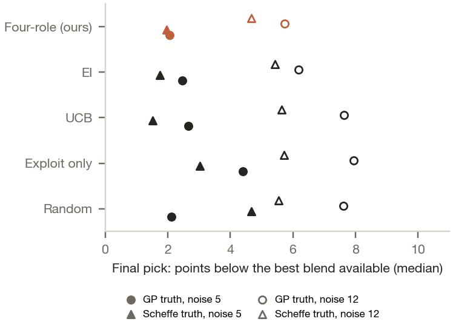

## Recommendation

Run five formulations next: four new blends of the four commercial media, plus a re-run of the best historical blend (E19) as an anchor on the same plate. Use four randomised wells per formulation, 20 wells in total. This plate is a screen. A blend that passes goes to a confirmation run, described below.

| Slot | Role | DMEM | RPMI-10 | X-VIVO 15 | AR5 | EUR/L | Predicted viability (80% range) | P(above E19) |
|---|---|---|---|---|---|---|---|---|
| 1 | Exploit | 44% | 26% | 19% | 11% | 177.69 | 70.2 (53.6 to 86.8) | 0.54 |
| 2 | Cheaper alternative | 43% | 56% | 1% | 0% | 173.92 | 65.9 (49.2 to 82.6) | 0.27 |
| 3 | Explore | 37% | 33% | 30% | 0% | 176.82 | 60.1 (41.1 to 79.2) | 0.12 |
| 4 | Expected improvement | 45% | 21% | 27% | 7% | 178.31 | 69.1 (51.5 to 86.7) | 0.38 |
| Anchor | E19 re-run | 44.6% | 20.1% | 19.6% | 15.7% | 178.43 | historical mean 81.0 | |

*Intervals are for one newly measured recipe mean, conditional on the model. P(above E19) compares the model's underlying responses for each blend and E19 and excludes unmodelled shifts between batches.*

Every new blend costs no more per litre than E19 at base prices, and meets that rule in at least 7 of 9 price scenarios. The batch has a job beyond finding a better blend. It tests the two assumptions the model leans on hardest: that the round-3 results reproduce on a new plate, and that AR5 volume can move to the other media at no cost to viability.

## The problem

<figure class="float"><figcaption>The four picks (stars) and the E19 anchor against the 24 historical blends, on the two components the model responds to. Colour is observed viability.</figcaption></figure>

The job is to choose the next 3 to 5 formulations under slow, noisy, small-batch experiments, not to win a prediction contest. A good choice teaches the lab something whatever the result.

I used the public PBMC media-blending data from Narayanan et al. (2025): 24 blends of four commercial media (DMEM-10, RPMI-10, X-VIVO 15, AR5) in four rounds of six, with 103 viability readings at 72 hours. I chose it over the Cosenza et al. (2022) repository because its tables are labelled and complete, and a four-part mixture keeps feasibility and cost easy to check. PBMC viability is far from Qorium's endpoints. The ingredients do not transfer either. E19 is 6.5% FBS by volume, and every pick raises that (slot 2 to 9.9%). Qorium states that no animal products are used in its process beyond the cells, so a Qorium campaign would fix an animal-product-free ingredient list before generating any candidate. The method transfers. The recipes and numbers do not.

**Objective.** Maximise viability at 72 hours, subject to a cost ceiling equal to E19's cost per litre under the same price scenario. In words, beat our best blend without paying more for it. I chose a constraint over a weighted desirability score because a lab manager can check a constraint by hand. A desirability weight hides the trade-off inside a number nobody signed off. The ceiling is a screening gate, not an adoption test: base-price savings against E19 are only 0.07 to 2.53%. Adoption needs an agreed minimum saving, judged on media cost per acceptable output (for Qorium, collagen or sheet area), not on viability per euro.

**Constraints.** I assume the lab can blend these four commercial media in any proportion at 1% resolution. Fractions are whole percentages and sum to 100%, so there are 176,851 candidate recipes. Each new blend differs by at least 5% of volume from every tested recipe, from the four single media and from the other picks. The lab can run five formulations, the most the brief allows.

## What the data says

| Finding | Number | Consequence |
|---|---|---|
| Round 3 beat every earlier round | mean 72.65% vs 39.98 to 50.65% | All six round-3 blends sit at 43.96 to 44.94% DMEM, so a recipe effect and a batch effect look the same |
| Two near-identical blends disagree | E10 48.15% vs E14 7.52%, 2.60% of volume apart | E14's readings agree with each other (SD 2.70). That could reflect biology or unrecorded preparation, cell-source or assay conditions. The data cannot tell which |
| Readings are noisy | pooled within-recipe SD 9.51 points | A 5-point gap between two blends is inside the noise |
| Cost barely separates the historical blends | EUR 172.49 to 180.98 per litre; r = 0.05 with viability | Base-price differences are small, but the ceiling still rules out 49.7% of candidate recipes, and FBS or AR5 price moves widen the spread |

Prices are provisional. Basal media, antibiotics and X-VIVO 15 are supplier list prices; DMEM and RPMI include 10% FBS and 1% antibiotics, as in the paper. FBS (EUR 672 per 500 mL, from a search snippet) is 74 to 80% of the supplemented cost. AR5 (CellGenix 20807) has no public price, so I set it equal to X-VIVO 15 and varied it up to 2.02 times. Real FBS and AR5 quotes are the most important missing inputs.

## Approach and why

I compared five surrogate models with leave-one-out validation and a forward-round test. Then I compared selection policies in a simulation.

| Model, all 24 recipes | RMSE | Rank corr. | 80% coverage | NLPD |
|---|---|---|---|---|
| GP, Matern 5/2, pooled noise | 16.77 | 0.61 | 0.79 | 5.93 |
| Random forest | 16.32 | 0.55 | 0.79 | 5.13 |
| Scheffe quadratic mixture model | 19.72 | -0.01 | 0.75 | 4.49 |
| Mean only | 18.77 | | 0.83 | 4.44 |

RMSE is typical error in viability points; coverage of 0.80 is ideal; lower NLPD means accurate and honestly uncertain.

No model clearly beats the average. The GP's leave-one-out rank correlation of 0.61 comes from separating the round-3 cluster from the rest; within rounds 0 to 2 it is 0.11. The GP finds the 44% DMEM band but cannot rank blends inside it. The Scheffe quadratic performed poorly (-0.01), and these data do not establish why. I chose the GP because it gives a usable uncertainty-based selection rule, which the batch needs. When E02 and E14 are withheld, the GP's error falls to 7.56 points. I report that as sensitivity, not as grounds to delete them.

The forward-round test is the honest one. Each model was trained on earlier rounds and asked to predict the next. Every model, the GP included, under-predicted round 3 by 22 to 29 points. The GP's forward-round rank correlations were 0.26, -0.31 and 0.26, so its rankings are not validated prospectively either. I use it to propose a diverse batch, not to forecast. The decision rests on the same-plate comparison with E19 and on independent confirmation before any blend is adopted.

**Policy.** The four slots are filled one at a time. After each pick, I condition the GP on a pending result equal to its prediction, with hyperparameters, scaling and historical noise fixed. That shrinks uncertainty around the pick, so later slots look elsewhere; a 5% volume gap keeps picks apart. `check_gp.py` verifies the conditioning against scikit-learn. The slot rules are:

1. **Exploit.** Highest predicted viability.
2. **Cheaper alternative.** Highest prediction at least 2.5% below the cost ceiling.
3. **Explore.** The recipe whose measurement most reduces total predicted-response uncertainty across the recipes the model says could still be the best.
4. **Expected improvement.** Highest expected gain over the current best, with slots 1 to 3 already pending.

<figure class="float"><figcaption>How far the blend the lab would pick from noisy results falls below the best blend available, across 30 paired campaigns. Noise level separates the results more than policy does.</figcaption></figure>

**Simulation.** No real replay of a policy exists, so I ran 30 paired campaigns (6 random blends, then three batches of 4) against two smooth synthetic truths, a GP fit and a Scheffe fit, at two noise levels, with the same eligibility rules and the same measurement error per recipe for every policy. Random sampling inside the rules ends 1.6 to 2.1 points from the best blend. Only UCB beats it reliably, and only at low noise (22 and 24 of 30 seeds, sign test p = 0.016 and 0.001). At the fitted noise of 11.8 points no policy differs from random, and the blend picked from noisy results sits 4.7 to 7.9 points below the best. With this much noise, confirmation limits the outcome more than candidate choice, which is why the plate carries an anchor and the plan ends in confirmation. I use the four-role policy because it covers cost and exploration in a way a lab can read and challenge; the simulation does not show it beats random.

## Uncertainty and how far to trust it

| Source | How I handle it |
|---|---|
| Reading noise | The GP learns 11.83 points SD on a recipe mean, against a root-mean-square reading SEM of 4.97. The gap covers run-to-run variation and model error, so I use the larger figure |
| My modelling choices | 18 full reruns: per-recipe noise; noise scaled by reading count; length-scale floors 0.05 and 0.2 and ceiling 3.0; three-coordinate fits without DMEM and without X-VIVO; without E02; without E14; 8 other price scenarios; E19 counted as pending. Plus one-at-a-time changes to each selection threshold |
| Batch shift | E19 re-run on the same plate, four wells per formulation, positions randomised over interior wells. All wells share one cell preparation and one medium preparation, so they measure within-plate repeatability only |

Slot 1 is unchanged in 10 of 18 reruns, but shifts 26% of volume under the per-recipe noise model. Slot 4 shifts by a median 7%. Fitting on three coordinates without DMEM moves all four picks, by 16 to 72%: four fractions carry one redundant coordinate, so which three the kernel sees is a real modelling choice, which I flag rather than resolve. These are recurring search directions, not uniquely established recipes. Slot 2 moves with prices and with the cheaper margin: at a 5% margin it becomes nearly pure RPMI-10. Slot 3 moves with the model, by up to 40% of volume without E14, because exploration follows uncertainty and uncertainty depends on the model.

One limit matters most. The fitted model is close to two-dimensional: DMEM's length scale sits at its 0.1 floor and RPMI-10's and AR5's at the 10.0 ceiling, so it treats RPMI-10 and AR5 as interchangeable. Slot 1 is 0.981 correlated with E19 under the model. Its P = 0.54 means the model cannot tell the two apart, not that slot 1 is better. All four picks hold less AR5 than E19 (11%, 0%, 0% and 7%, against 15.7%), so this batch tests that assumption directly.

## From plate to decision

**1. Is the plate valid?** Before any comparison, the assay owner checks the plate against criteria set in advance: missing wells, spread between wells, anchor viability and preparation records. The source study pooled cultures on a specialised plate, so reading 20 wells individually is a protocol change to agree first. An invalid or inconclusive plate means investigate and repeat the same five formulations. A low anchor triggers investigation; on its own it does not prove a historical batch effect. All cell-containing wells use one donor and one thaw, the plate carries blanks and heat-killed controls, and the read records viable cells per mL as well as viability; details are in `reports/lab_plan.md`.

**2. Screen.** A blend passes if its mean is no more than 5 points below the same-plate E19 mean, at equal or lower cost. That is a non-inferiority margin I propose; the lab sets the real one. With four wells the 90% interval on a blend-versus-E19 difference is about plus or minus 13 points (t, 6 degrees of freedom), so the screen only filters: a blend truly equal to E19 passes 77% of the time, one 10 points worse 23%.

| Valid plate, outcome | Next step |
|---|---|
| E19 near its historical 81%, slot 1 passes | The round-3 region holds on a new plate. Move further from AR5 next round |
| E19 well below 81% | Judge every pick against this plate's E19. Review preparation and assay conditions before the next round |
| Slot 3 close to slots 1 and 4 | Good results extend beyond the 44% DMEM band. Widen the search |
| Slot 2 passes | RPMI-10 can stand in for the serum-free media in this system. It raises FBS to 9.9%, so it is not a step toward an animal-free medium |
| Slot 4 passes or beats E19 | Moving AR5 volume to X-VIVO 15 is a lead |

**3. Confirm one finalist, two at most.** A paired comparison against concurrent E19, blocked by independent cell and medium preparations on different days. Accept if the one-sided 95% lower bound on the finalist-minus-E19 difference is above minus 5 points, with acceptable cost and quality. Size it from the preparation-to-preparation variance the pilot measures. For scale only: if the 9.51-point SD applied to independent preparations, 20 per arm would give 51% power at a true difference of zero, and about 45 per arm would give 80%.

## How the strategy changes

| If | Then |
|---|---|
| Only 10 to 20 prior experiments | Spend more of the batch on space-filling picks, use a simpler kernel with strong priors, and widen the intervals. With 6 random points, the GP in this data was confidently wrong (round-1 coverage 17%) |
| Low-fidelity assays are cheap but noisy | Screen many blends with them and model their noise explicitly. Use a multi-fidelity GP that learns how the cheap readout maps to the expensive one, as Cosenza et al. did with AlamarBlue against cell counts. First run paired calibration experiments, measuring the same cultures with both assays, so the mapping is estimated rather than assumed |
| High-fidelity assays are expensive but reliable | Reserve them for finalists and anchors, plus a spread of blends so the cheap-to-expensive link stays estimable. Choose each run by information per euro |
| Cost data is incomplete | Keep cost as a constraint, select across a price-scenario grid as here, and prefer picks feasible in most scenarios. Buy the missing price that moves the decision most |
| Some components are categorical or constrained | A mixed kernel or one GP per category, with limits as hard rules in the candidate generator. The paper's K. phaffii data (categorical carbon source) is the test case |
| Experiments run in parallel batches | Choose the batch jointly, by sequential conditioning as here or with q-acquisition functions, and enforce a minimum distance between picks. Re-run an anchor in every batch so batch shifts become measurable |

## Risks and validation plan

- **Transfer.** PBMC viability and these FBS-supplemented media stand in for the method only. Qorium's cells are adherent bovine fibroblasts, and animal-free rules out more than FBS (animal-derived insulin, transferrin, albumin, trypsin). The same loop would run on an approved ingredient list, with growth and collagen endpoints and real quotes; `reports/lab_plan.md` sketches that first plate.
- **Model.** The forward-round failure is the main warning. If the next plate's E19 lands far from 81%, refit with a batch term before choosing the round after.
- **Validation.** Success for this batch is at least one new blend passing the screening rule above, and a slot 3 result that tells us whether the search space is wider than round 3 suggested. Adoption needs the confirmation run and the agreed business criterion.

**Code and sources.** `run_all.sh` reproduces this snapshot from public data in about 5 minutes (seed 20261002); a weekly loop would add a versioned recipe manifest and results template (both in `outputs/`). Data: Narayanan et al. 2025, Nat. Commun. 16:6055. Method reference: Cosenza et al. 2022, Biotechnol. Bioeng. 119:2447. Prices and the Qorium process note are sourced in the repo. AI assistants drafted code and text and reviewed the work; the judgement calls are mine.
