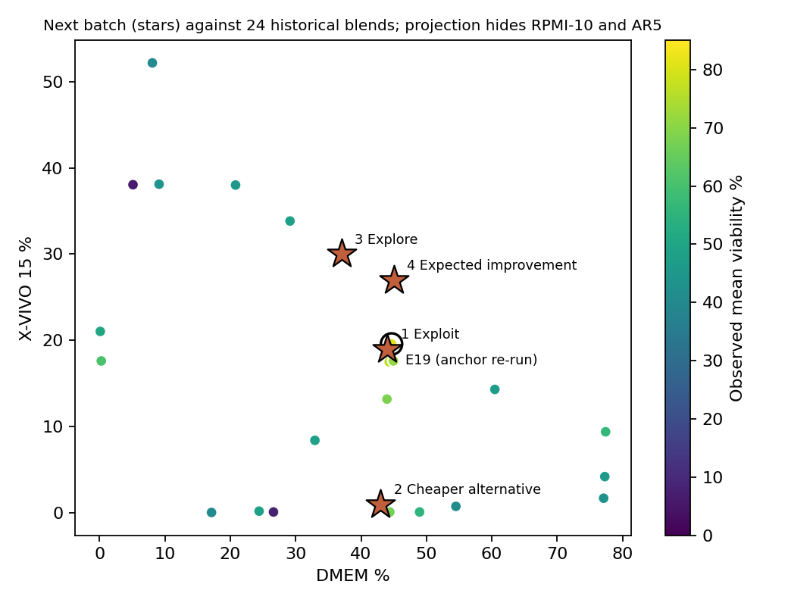

## Recommendation

Run five formulations next: four new blends of the four commercial media, plus a re-run of the best historical blend (E19) as an anchor on the same plate. Use four randomised wells per formulation, 20 wells in total. This plate is a screen. A blend that passes goes to a confirmation run, described below.

| Slot | Role | DMEM | RPMI-10 | X-VIVO 15 | AR5 | EUR/L | Predicted viability (80% range) | P(above E19) |
|---|---|---|---|---|---|---|---|---|
| 1 | Exploit | 44% | 26% | 19% | 11% | 177.69 | 70.2 (53.6 to 86.8) | 0.54 |
| 2 | Cheaper alternative | 43% | 56% | 1% | 0% | 173.92 | 65.9 (49.2 to 82.6) | 0.27 |
| 3 | Explore | 37% | 33% | 30% | 0% | 176.82 | 60.1 (41.1 to 79.2) | 0.12 |
| 4 | Expected improvement | 45% | 21% | 27% | 7% | 178.31 | 69.1 (51.5 to 86.7) | 0.38 |
| Anchor | E19 re-run | 44.6% | 20.1% | 19.6% | 15.7% | 178.43 | historical mean 81.0 | |

{width=50%}

*Intervals are for one newly measured recipe mean, conditional on the model. P(above E19) compares the model's underlying responses for each blend and E19 and excludes unmodelled shifts between batches.*

Every new blend costs no more per litre than E19 at base prices, and meets that rule in at least 7 of 9 price scenarios. The batch has a job beyond finding a better blend. It tests the two assumptions the model leans on hardest: that the round-3 results reproduce on a new plate, and that AR5 volume can move to the other media at no cost to viability.

## The problem

The job is to choose the next 3 to 5 formulations under slow, noisy, small-batch experiments, not to win a prediction contest. A good choice teaches the lab something whatever the result.

I used the public PBMC media-blending data from Narayanan et al. (2025): 24 blends of four commercial media (DMEM-10, RPMI-10, X-VIVO 15, AR5) in four rounds of six, with 103 viability readings at 72 hours. I chose it over the Cosenza et al. (2022) repository because its tables are labelled and complete, and a four-part mixture keeps feasibility and cost easy to check. PBMC viability is far from Qorium's endpoints. The method transfers. The numbers do not.

**Objective.** Maximise viability at 72 hours, subject to a cost ceiling equal to E19's cost per litre under the same price scenario. In words, beat our best blend without paying more for it. I chose a constraint over a weighted desirability score because a lab manager can check a constraint by hand. A desirability weight hides the trade-off inside a number nobody signed off.

**Constraints.** I assume the lab can blend these four commercial media in any proportion at 1% resolution. Fractions are whole percentages and sum to 100%, so there are 176,851 candidate recipes. Each new blend differs by at least 5% of volume from every tested recipe, from the four single media and from the other picks. The lab can run five formulations, the most the brief allows.

## What the data says

| Finding | Number | Consequence |
|---|---|---|
| Round 3 beat every earlier round | mean 72.65% vs 39.98 to 50.65% | All six round-3 blends sit at 43.96 to 44.94% DMEM, so a recipe effect and a batch effect look the same |
| Two near-identical blends disagree | E10 48.15% vs E14 7.52%, 2.60% of volume apart | E14's readings agree with each other (SD 2.70). That could reflect biology or unrecorded preparation, cell-source or assay conditions. The data cannot tell which |
| Readings are noisy | pooled within-recipe SD 9.51 points | A 5-point gap between two blends is inside the noise |
| No single medium was tested in the main study | 0 of 24 | The model extrapolates at the edges of the mixture |
| Cost barely separates the historical blends | EUR 172.49 to 180.98 per litre; r = 0.05 with viability | Base-price differences are small, but the ceiling still rules out 49.7% of candidate recipes, and FBS or AR5 price moves widen the spread |

Prices are provisional. Basal media, antibiotics and X-VIVO 15 are supplier list prices; DMEM and RPMI include 10% FBS and 1% antibiotics, as in the paper. FBS (EUR 672 per 500 mL, from a search snippet) is 74 to 80% of the supplemented cost. AR5 (CellGenix 20807) has no public price, so I set it equal to X-VIVO 15 and varied it up to 2.02 times. Across 9 FBS and AR5 scenarios, E19 costs EUR 134.9 to 250.9 per litre. Real FBS and AR5 quotes are the most important missing inputs.

## Approach and why

I compared five surrogate models with leave-one-out validation and a forward-round test. Then I compared selection policies in a simulation.

| Model, all 24 recipes | RMSE | Rank corr. | 80% coverage | NLPD |
|---|---|---|---|---|
| GP, Matern 5/2, pooled noise | 16.77 | 0.61 | 0.79 | 5.93 |
| Random forest | 16.32 | 0.55 | 0.79 | 5.13 |
| Scheffe quadratic mixture model | 19.72 | -0.01 | 0.75 | 4.49 |
| Mean only | 18.77 | | 0.83 | 4.44 |

RMSE is typical error in viability points; coverage of 0.80 is ideal; lower NLPD means accurate and honestly uncertain. A per-recipe-noise GP variant is in the detailed report.

No model clearly beats the average. In leave-one-out, the GP ranks blends better than chance (rank correlation 0.61). The Scheffe quadratic performed poorly here (-0.01), and these data do not establish why. I chose the GP because it gives a usable uncertainty-based selection rule, which the batch needs. When E02 and E14 are withheld, the GP's error falls to 7.56 points. I report that as sensitivity, not as grounds to delete them.

The forward-round test is the honest one. Each model was trained on earlier rounds and asked to predict the next. Every model, the GP included, under-predicted round 3 by 22 to 29 points. The GP's forward-round rank correlations were 0.26, -0.31 and 0.26, so its rankings are not validated prospectively either. I use it to propose a diverse batch, not to forecast. The decision rests on the same-plate comparison with E19 and on independent confirmation before any blend is adopted.

**Policy.** The four slots are filled one at a time. After each pick, I condition the GP on a pending result equal to its current prediction, with the hyperparameters, data scaling and every historical noise term held fixed. That shrinks uncertainty around the pick without moving the predictions, so the exploration and expected-improvement slots look elsewhere. A minimum 5% volume gap enforces separation between picks. A script (`check_gp.py`) verifies that the conditioning matches scikit-learn, leaves the posterior mean unchanged and never raises the variance. The slot rules are:

1. **Exploit.** Highest predicted viability.
2. **Cheaper alternative.** Highest prediction at least 2.5% below the cost ceiling.
3. **Explore.** The recipe whose measurement most reduces total predicted-response uncertainty across the recipes the model says could still be the best.
4. **Expected improvement.** Highest expected gain over the current best, with slots 1 to 3 already pending.

**Simulation.** There is no real replay of a policy, because only one sequence of experiments was ever run. Instead I ran 30 paired campaigns (6 random blends, then three batches of 4) against two smooth synthetic truths, a GP fit and a Scheffe fit, at two noise levels. Always picking the current best was no better than random, and was worse on the Scheffe truth. The four-role policy beat random in 19 to 23 of 30 seeds in every setting, the most consistent result in the comparison. At realistic noise, plain UCB and EI beat random in only 12 to 16 of 30 seeds. The simulation supports mixing roles. It does not prove that one exploration slot in four is the best split, and it says nothing about E14-style failures or round-to-round shifts.

## Uncertainty and how far to trust it

| Source | How I handle it |
|---|---|
| Reading noise | The GP learns 11.83 points SD on a recipe mean, against a typical reading SEM of 4.97. The gap covers run-to-run variation and model error, so I use the larger figure |
| Model form | Reruns with per-recipe noise, length-scale floors of 0.05 and 0.2, and a ceiling of 3.0 |
| Unexplained low results | Reruns without E02 and without E14 |
| Prices | Reruns under 8 alternative FBS and AR5 scenarios |
| Arbitrary rules | One-at-a-time changes to the 2.5% margin, 5% gap, 6-of-9 scenario rule and single-media exclusion |
| Batch shift | E19 re-run on the same plate, four wells per formulation, positions randomised over interior wells. All wells share one cell preparation and one medium preparation, so they measure within-plate repeatability only |

Slot 1 is unchanged in 8 of 14 reruns, but shifts 26% of volume under the per-recipe noise model. Slot 4 shifts by a median 7% and at most 12%. These are recurring search directions, not uniquely established recipes. Slot 2 moves with prices and with the cheaper margin: at a 5% margin it becomes nearly pure RPMI-10. Slot 3 moves with the model, by up to 40% of volume without E14, because exploration follows uncertainty and uncertainty depends on the model.

One limit matters most. The fitted model is close to two-dimensional. Its DMEM length scale sits at the 0.1 floor and its RPMI-10 and AR5 length scales sit at the 10.0 ceiling, so it treats RPMI-10 and AR5 as interchangeable. Slot 1 is 0.981 correlated with E19 under the model. Its P = 0.54 means the model cannot tell the two apart, not that slot 1 is better. All four picks hold less AR5 than E19 (11%, 0%, 0% and 7%, against 15.7%), so this batch tests that assumption directly.

## How the result changes the next decision

| Outcome | Next step |
|---|---|
| E19 re-run near 80%, slot 1 within noise of it | The round-3 region holds on a new plate. Move further from AR5 next round |
| E19 re-run near 55% | Investigate reproducibility and batch conditions before the next round. Judge every pick against this plate's E19, not against 81% |
| Slot 3 close to slots 1 and 4 | Good results extend beyond the 44% DMEM band. Widen the search |
| Slot 2 passes the screening rule | A blend with almost no serum-free medium is a candidate. Confirm it and get real FBS and AR5 quotes |
| Slot 4 above E19 | Moving AR5 volume to X-VIVO 15 is a lead. Confirm with replicates before cutting AR5 |

**Decision rule, set before the plate runs.** A blend passes the screen if its mean is no more than 5 viability points below the same-plate E19 mean, at equal or lower cost. Five points is my proposed acceptable loss; the lab should set the real margin. Four wells cannot establish equivalence. With a within-recipe SD of 9.51 points, the 90% interval on a blend-versus-E19 difference is about plus or minus 11 points at 4 wells per arm and about plus or minus 5 points at 20. So a blend that passes goes to confirmation: about 20 wells per arm, spread over at least two independent cell and medium preparations on different days.

## How the strategy changes

| If | Then |
|---|---|
| Only 10 to 20 prior experiments | Spend more of the batch on space-filling picks, use a simpler kernel with strong priors, and widen the intervals. With 6 random points, the GP in this data was confidently wrong (round-1 coverage 17%) |
| Low-fidelity assays are cheap but noisy | Screen many blends with them and model their noise explicitly. Use a multi-fidelity GP that learns how the cheap readout maps to the expensive one, as Cosenza et al. did with AlamarBlue against cell counts. First run paired calibration experiments, measuring the same cultures with both assays, so the mapping is estimated rather than assumed |
| High-fidelity assays are expensive but reliable | Reserve them for finalists and anchors, plus a spread of other blends so the cheap-to-expensive relationship stays estimable. Choose each high-fidelity run by information per euro, not by predicted value alone |
| Cost data is incomplete | Keep cost as a constraint, run the selection across a price-scenario grid as done here, and prefer picks that stay feasible in most scenarios. The missing price with the most effect on the decision is the next thing to buy |
| Some components are categorical or constrained | Use a mixed kernel or one GP per category level, and encode limits as hard rules in the candidate generator. The paper's K. phaffii data, with a categorical carbon source, would be the test case |
| Experiments run in parallel batches | Choose the batch jointly, by sequential conditioning as here or with q-acquisition functions, and enforce a minimum distance between picks. Re-run an anchor in every batch so batch shifts become measurable |

## Risks and validation plan

- **Transfer.** PBMC viability stands in for the method only. For Qorium, the same loop would run on bovine fibroblast expansion, collagen output and leather-relevant quality assays, with real supplier quotes.
- **Model.** The forward-round failure is the main warning. If the next plate's E19 lands far from 81%, refit with a batch term before choosing the round after.
- **Thresholds.** The cost ceiling, the 2.5% margin and the 5% gap are judgement calls. The stress table shows which picks depend on them.
- **Validation.** Success for this batch is at least one new blend passing the screening rule above, and a slot 3 result that tells us whether the search space is wider than round 3 suggested. Adoption needs the confirmation run. Over the next two rounds, track the best confirmed viability per euro.

**Code.** `run_all.sh` rebuilds every table, figure and the recommendation from public data (seed 20261002; 5 min 7 s from a fresh environment on an Apple-silicon laptop). The schema, decision log and three external reviews are in `docs/`.

*Sources.* Narayanan H. et al. (2025), Nature Communications 16, 6055, data at doi:10.6084/m9.figshare.27715134. Cosenza Z. et al. (2022), Biotechnology and Bioengineering 119(9), 2447-2458. Prices from Thermo Fisher Germany, Lonza and Fisher Scientific Austria, accessed 2 October 2026 (see `data/inputs/price_sources.csv`).
