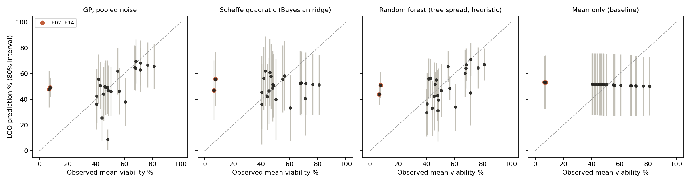
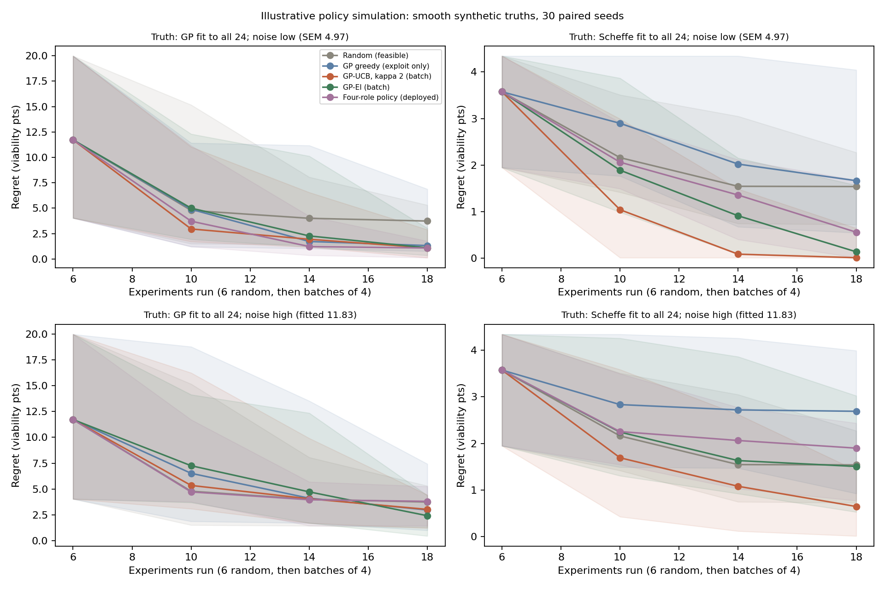

# Cost rule and model comparison

Regenerate with `python scripts/design_space.py` and `python scripts/compare_models.py`. Run both from the project root with `.venv`. The random seed is 20261002. `python scripts/check_gp.py` runs the checks that the GP posterior is computed and updated correctly.

## Cost and feasibility rule

- **Cost rule.** A candidate is eligible if its prepared-media cost per litre is no higher than the cost of PBMC-E19, under the same price scenario. E19 is the best observed blend. The rule therefore asks one question: can a new blend match or beat E19 without costing more? It is a design choice, not a budget the lab gave us.
- **Dispensing rule.** Every fraction is a whole percentage and the four fractions sum to 100%. That gives 176,851 possible recipes.
- **Prices are provisional.** FBS comes from a search-result snippet. AR5 is a hypothetical proxy. See `data/inputs/price_sources.csv`.

| Price scenario | Ceiling (EUR/L) | Share of recipes eligible | Historical blends eligible |
| --- | --- | --- | --- |
| Base | 178.43 | 0.503 | 15 of 24 |
| FBS 0.5x, AR5 1.0x | 134.93 | 0.316 | 14 |
| FBS 1.0x, AR5 2.02x | 207.39 | 0.414 | 8 |
| FBS 1.5x, AR5 1.0x | 221.93 | 0.745 | 14 |
| FBS 1.5x, AR5 2.02x | 250.89 | 0.466 | 8 |

All 9 scenarios are in `reports/tables/cost_rule_feasibility.csv`. These scenario counts are a stress test. They are not probabilities.

## Surrogate models compared

| Model | Notes |
| --- | --- |
| GP, pooled noise | Matern 5/2 kernel, one length scale per component with a floor of 0.1, and a learned noise term |
| GP, per-recipe SEM noise | The same GP, but each recipe's measured SEM is treated as its known noise |
| Scheffe quadratic (Bayesian ridge) | The classical mixture-design model: 4 linear terms plus 6 two-way blending terms |
| Random forest | No smoothness assumption. The 80% interval comes from the spread across trees, which is a rough guide and not a true predictive interval |
| Mean only | Floor: predicts the training average for every recipe |

## Leave-one-out results

Each recipe is predicted from the others. "80% cover" is the share of observed values that fall inside the model's 80% interval; a well-calibrated model scores about 0.80. NLPD is the negative log predictive density: lower is better, and it rewards accurate predictions with honest uncertainty. The primary evaluation uses all 24 recipes. The other rows refit the models without one or both unexplained low results (E02 at 6.54%, E14 at 7.52%) and then score them on the recipes that remain.

| Training data | Model | RMSE (pts) | Spearman | 80% cover | NLPD |
| --- | --- | --- | --- | --- | --- |
| **All 24 (primary)** | GP, pooled noise | 16.77 | 0.61 | 0.79 | 5.93 |
| All 24 | GP, per-recipe SEM | 20.11 | 0.54 | 0.75 | 5.61 |
| All 24 | Scheffe quadratic | 19.72 | -0.01 | 0.75 | 4.49 |
| All 24 | Random forest | 16.32 | 0.55 | 0.79 | 5.13 |
| All 24 | Mean only | 18.77 | n/a | 0.83 | **4.44** |
| Without E02 | GP, pooled noise | 13.37 | 0.66 | 0.87 | 5.75 |
| Without E02 | Random forest | 13.77 | 0.46 | 0.83 | 4.56 |
| Without E14 | GP, pooled noise | 15.28 | 0.60 | 0.74 | 4.97 |
| Without E14 | Random forest | 12.39 | 0.59 | 0.83 | 4.94 |
| Without both | GP, pooled noise | 7.56 | 0.72 | 0.64 | 3.90 |
| Without both | GP, per-recipe SEM | 7.81 | 0.67 | 0.82 | 3.53 |
| Without both | Mean only | 13.15 | n/a | 0.82 | 4.02 |

The full table is in `reports/tables/model_loo.csv`. Mean-only has no ranking ability, so its Spearman is shown as n/a.

What this shows:

1. **On all 24 recipes, no model clearly beats the mean.** The GP and the random forest have the lowest RMSE (16.77 and 16.32). The mean-only model has the best NLPD (4.44 against 5.93 for the GP). So the GP's uncertainty is less honest than a flat average's.
2. **The GP ranks recipes better than chance.** Its Spearman is 0.61 on all 24. The Scheffe model is at -0.01. Ranking is the property the batch selection relies on.
3. **E02 and E14 dominate the error.** They are unexplained low outcomes. Their readings agree with each other, and the data cannot tell a failed run from a sharp biological response. The GP's predictions for E10 are pulled down by E14, which sits 2.60% of volume away from it. Removing both drops the GP RMSE to 7.56. That is a sensitivity result, not grounds to delete them. Both stay in the primary fit.

## Forward-round check

Each model is trained on rounds 0 to r and predicts round r+1. This is the closest the data gets to a real test of forecasting. The models fail it.

| Model | Test round | RMSE | Bias | 80% cover | NLPD |
| --- | --- | --- | --- | --- | --- |
| GP, pooled noise | 1 | 25.56 | 14.37 | 0.17 | 245.96 |
| GP, pooled noise | 2 | 18.73 | -3.06 | 0.83 | 4.49 |
| GP, pooled noise | 3 | 27.14 | 26.76 | 0.00 | 5.31 |
| Mean only | 3 | 28.74 | 28.34 | 0.00 | 5.40 |

- The round-1 NLPD of 245.96 means the GP trained on 6 random points was confidently wrong.
- Every model under-predicts round 3 by 22 to 29 points. The pooled GP predicts a mean of 45.89% against an observed 72.65%.
- Two explanations fit: round 3 found a new region, or round 3 ran on a better day (cells, reagents, operator). The data cannot separate them.

The consequence for the batch: treat the GP as a ranking aid, not a forecast. Absolute predictions carry about 20 points of uncertainty beyond what the model reports. The decision rests on a same-plate comparison with a re-run of E19.

## Policy comparison by simulation (illustrative)

There is no real way to replay a policy, because only one sequence of experiments was ever run. So each policy runs simulated campaigns against a known synthetic truth:

- Start with 6 random feasible recipes, then run 3 batches of 4.
- Search the 6,219 recipes at 2% steps that meet the cost rule at base prices and in at least 6 of 9 price scenarios.
- Apply the same rules to every policy: a 5% minimum gap from measured recipes, from the single media and from the policy's own other picks.
- Use 30 paired seeds: every policy sees the same start points and the same noise draws.
- Use two truths, a GP fit and a Scheffe fit to all 24 recipes.
- Use two noise levels: the typical reading SEM (4.97) and the GP's fitted noise (11.83).
- Include the four-role policy actually used for the recommendation.
- Score two things: discovery (the best blend sampled) and the finalist (the blend the lab would pick from noisy results).

| Truth, noise | Random | Exploit only | GP-UCB | GP-EI | Four-role (deployed) |
| --- | --- | --- | --- | --- | --- |
| GP fit, 4.97 | 3.74 / 4.92 | 1.33 / 4.25 | 1.09 / 3.73 | 1.10 / **1.69** | **1.08** / 2.02 |
| GP fit, 11.83 | 3.74 / 8.63 | 2.97 / **5.77** | 3.03 / 9.86 | **2.42** / 7.13 | 3.80 / 8.41 |
| Scheffe fit, 4.97 | 1.54 / 2.95 | 1.67 / 3.10 | **0.01** / 2.38 | 0.14 / **1.98** | 0.56 / 2.32 |
| Scheffe fit, 11.83 | 1.54 / 8.09 | 2.69 / 6.40 | **0.65** / 7.12 | 1.51 / 5.73 | 1.90 / **5.20** |

Each cell gives two medians after 18 runs, in viability points. The first is discovery regret: the best achievable viability minus the true viability of the best blend sampled. The second is finalist regret: the best achievable minus the true viability of the blend the lab would pick, the one with the highest noisy observed mean. Every policy faces the same eligibility rules: the cost rule in at least 6 of 9 price scenarios, a 5% minimum gap from measured recipes, single media and the policy's own other picks. Paired wins over random are in `reports/tables/policy_simulation_summary.csv`.

What this shows:

1. **The eligibility rules do much of the work.** Random sampling inside them has a median discovery regret of 3.74 on the GP truth. An earlier run without these rules, on the wider base-feasible grid, gave 7.82. The grids differ, so the comparison is indicative, but most of the four-role policy's earlier advantage came from the rules, not from the acquisition logic.
2. **At low noise the GP policies help.** UCB, EI and the four-role policy beat random on discovery in 20 to 24 of 30 paired seeds. Exploit-only beats it in 19 on the GP truth and 12 on the Scheffe truth.
3. **At realistic noise, no policy stands out.** At 11.83 every policy beats random in only 9 to 17 of 30 seeds. The finalist the lab would pick sits 5.2 to 9.9 points below the best available, whichever policy produced the data.
4. **So the bottleneck is confirmation.** With noise near 12 points, choosing and confirming a winner limits the outcome more than choosing candidates does. That supports spending capacity on an anchor, replicate wells and a confirmation run.

**Limits:**

- Both truths are smooth fits to the same 24 points. Neither contains a failure mechanism like E14 or a batch shift like round 3.
- The finalist is chosen from single noisy observations. Replicate wells would narrow the finalist gap; the simulation does not model them.
- The simulated campaigns run no anchor.
- The four-role policy includes a cheaper-alternative slot, which costs it some viability by design.

## Decision for batch selection

- **Model:** pooled-noise GP fit on all 24 recipes, with the four-role selection policy, under the cost rule, in 1% steps.
- **How the batch is built:** each pick is added as a pending point. Its pretend result is the current posterior mean. The hyperparameters, the data scaling and every historical noise term stay fixed. `check_gp.py` verifies that the posterior mean does not move and the variance never increases.
- **Why the four-role policy, given the simulation:** no policy dominates at realistic noise. The four-role policy makes cost and exploration explicit, one slot each, which a lab can read and challenge.
- **Sensitivity checks:** per-recipe noise; length-scale floors of 0.05 and 0.2 and a ceiling of 3.0; dropping E02 or E14; E19 counted as pending; 8 alternative price scenarios. Separately, one-at-a-time changes to the selection thresholds. See `reports/batch_selection.md`.
- **Anchor:** a re-run of E19 on the same plate.

## Limits

- All 24 points were chosen adaptively, so leave-one-out errors are not the errors to expect on random new recipes.
- The fitted noise (11.83 points SD on a recipe mean) also absorbs whatever the model gets wrong, so it overstates assay noise.
- Three of the four length scales sit on a bound. DMEM is at its 0.1 floor. RPMI-10 and AR5 are at the 10.0 ceiling, which means the model treats them as interchangeable. The batch sensitivity checks test floors of 0.05 and 0.2 and a ceiling of 3.0. With the ceiling at 3.0, RPMI-10 and AR5 settle at 3.0 and the picks move by at most 2% of volume.
- The per-recipe noise model uses the mean squared SEM as the noise for a new recipe mean. Its leave-one-out coverage is therefore slightly approximate.
- sklearn convergence warnings from the hyperparameter fit are suppressed in `compare_models.py`. Restarts reduce the risk of a poor local optimum but do not remove it.
